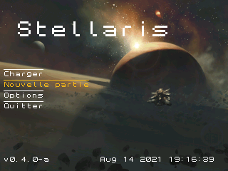
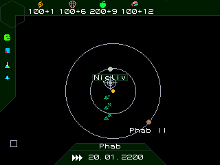
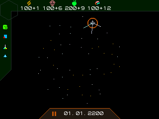
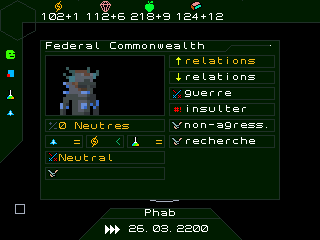

# STELLARIS TI remake
[](https://github.com/StellarisTI83/StellarisTI83/actions/workflows/make.yml)

## Metrics of the project


```
cloc StellarisTI83/
      79 text files.
      79 unique files.                              
       7 files ignored.

github.com/AlDanial/cloc v 1.74  T=0.29 s (254.4 files/s, 55691.7 lines/s)
-------------------------------------------------------------------------------
Language                     files          blank        comment           code
-------------------------------------------------------------------------------
C                               30           1379            943          10456
C/C++ Header                    33            444            617           1740
YAML                             2             24              0            186
Markdown                         3             26              0             89
JSON                             3              0              0             40
make                             1             11              9             17
Bourne Shell                     1              0              0              1
-------------------------------------------------------------------------------
SUM:                            73           1884           1569          12529
-------------------------------------------------------------------------------

```


```
sloccount  StellarisTI83/

Totals grouped by language (dominant language first):
ansic:        12249 (99.99%)
sh:               1 (0.01%)


Total Physical Source Lines of Code (SLOC)                = 12,250
Development Effort Estimate, Person-Years (Person-Months) = 2.78 (33.32)
 (Basic COCOMO model, Person-Months = 2.4 * (KSLOC**1.05))
Schedule Estimate, Years (Months)                         = 0.79 (9.48)
 (Basic COCOMO model, Months = 2.5 * (person-months**0.38))
Estimated Average Number of Developers (Effort/Schedule)  = 3.52
Total Estimated Cost to Develop                           = $ 375,132
 (average salary = $56,286/year, overhead = 2.40).

```

## Presentation

This is a remake of Stellaris (by _Paradox Development Studio_) for TI-83 Premium CE and TI-84 Plus CE.

The game is actually on a dev stage. It is in French and will soon be in English.

## Screens

### The main menu

### Stellar system

### Galactic view

### Contact menu


## Installing

The game need the toolchain [CeDev](https://github.com/CE-Programming/toolchain) to be make

- You nees to use the last version ([v8.8](https://github.com/CE-Programming/toolchain/releases/tag/v9.1))


We recommend to use an emulator like [CeMu](https://github.com/CE-Programming/CEmu)

- 64 bit can use the last version ([v1.3](https://github.com/CE-Programming/CEmu/releases/tag/v1.3))
- 32 bit use the v1.0 version ([v1.0](https://github.com/CE-Programming/CEmu/releases/tag/v1.0))

Use `make gfx` command to make the graphx files and `make` to compil the program.

## To do list (French)

- [x] Menus stations
- [x] Menu planètes
  - [ ] Niveaux des batiments
- [x] Plusieurs actions de suite
- [x] Rajout d'une console
- [x] Changement des sprites de local à appvar
- [ ] Menu flottes
  - [ ] Rajout des stations scientifiques et minières
  - [ ] Actions flottes
  - [x] Pathfinding flottes
  - [x] Faire bouger flottes un systeme par un systeme
  - [x] Flottes militaires de plusieurs types
- [ ] Recherches
- [ ] Rajout de plusieurs civilisations
  - [ ] Rajout de l'ia
  - [ ] Diplomatie
- [x] Rajout des notifications
- [ ] Menu marché
- [x] Revenus
- [x] Refaire le menu d'entrée
- [ ] Création de sauvegardes
- [ ] Traduction totale
